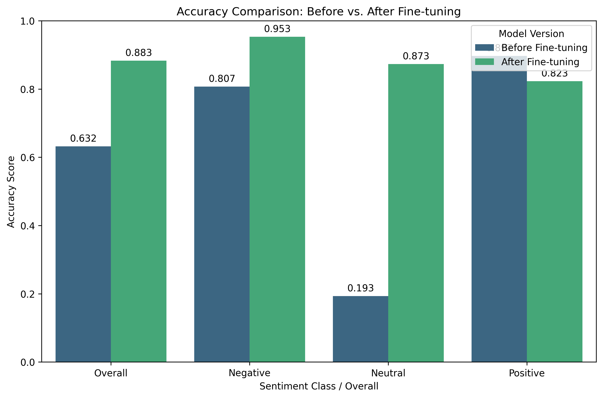
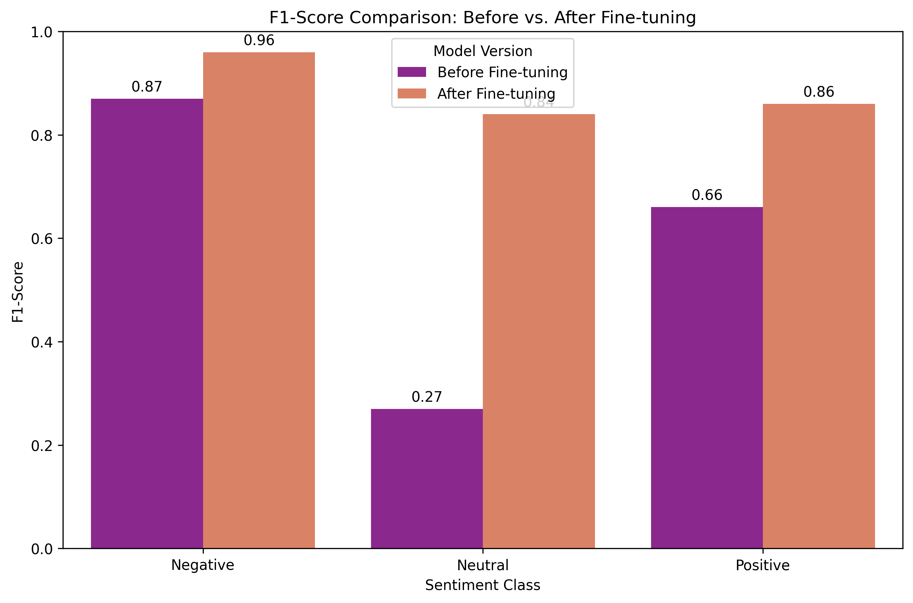

# Financial Sentiment Analysis with Fine-tuned Gemma 7B-IT

This repository contains the code and resources for a project on fine-tuning Google's Gemma 7B-IT Large Language Model for financial sentiment analysis. The project leverages Parameter-Efficient Fine-Tuning (PEFT) using the LoRA method to adapt the model to the Financial PhraseBank dataset.

## Project Overview

The objective of this project was to enhance the sentiment classification capabilities of a pre-trained LLM for financial texts, a domain known for its unique linguistic nuances. We fine-tuned Gemma 7B-IT on a specialized dataset and evaluated its performance against a baseline.

## Dataset

The project utilizes the **Financial PhraseBank dataset**. This dataset consists of 4,845 English news headlines, annotated with positive, negative, or neutral sentiment specifically from an investor's perspective.

**How to Obtain and Use the Dataset:**
* **If running on Kaggle:** The dataset is typically mounted at `/kaggle/input/financial-phrasebank/all-data.csv`. Ensure your notebook references this path if running directly on Kaggle.
* **If running locally:** Due to varying hosting and access methods, the `all-data.csv` file for this dataset is not included directly in this repository. Users wishing to replicate this project locally should obtain the "Financial PhraseBank dataset" separately by searching for it on platforms like Kaggle (e.g., "Financial PhraseBank dataset") or from academic sources associated with Aalto University. Once acquired, please place the `all-data.csv` file in the root directory of this repository for the code to run correctly.

## Model

The base model used is Google's [Gemma 7B-IT](https://huggingface.co/google/gemma-7b-it), a powerful instruction-tuned Large Language Model. Fine-tuning was performed using the Low-Rank Adaptation (LoRA) method, a Parameter-Efficient Fine-Tuning (PEFT) technique, to adapt the model to the financial domain efficiently.

## Repository Contents

* `fine-tune-gemma-7b-it-for-sentiment-analysis.ipynb`: The main Jupyter Notebook containing all the code for data loading, preprocessing, model fine-tuning, evaluation, and visualization.
* `model_download_link.txt`: Contains a Google Drive link to download the compressed `trained-model` folder, which includes the saved LoRA adapter weights (`adapter_model.safetensors`) and configuration (`adapter_config.json`) after fine-tuning.
* `test_predictions.csv`: CSV file containing the model's predictions on the test set.
* `figures/`: Directory containing all the generated plots and confusion matrices from the evaluation.
    * `accuracy_comparison_bar_chart.png`
    * `classification_report_heatmap_finetuned.png`
    * `confusion_matrix_gemma_finetuned.png`
    * `confusion_matrix_gemma_pre_finetuned.png`
    * `f1_score_comparison_bar_chart.png`
    * `precision_comparison_bar_chart.png`
    * `recall_comparison_bar_chart.png`
    * `training_validation_loss_plot.png`
* `requirements.txt`: A list of Python dependencies required to run the notebook.

## Setup and Usage

This project was developed within a Kaggle environment. For local execution, ensure you have a suitable Python environment (Python 3.10+ recommended) with GPU support (e.g., CUDA) for optimal performance.

1.  **Clone the repository:**
    ```bash
    git clone [https://github.com/Samuel-Idriss/Financial-Sentiment-Analysis-with-Fine-tuned-Gemma-7B-IT.git](https://github.com/Samuel-Idriss/Financial-Sentiment-Analysis-with-Fine-tuned-Gemma-7B-IT.git)
    cd Financial-Sentiment-Analysis-with-Fine-tuned-Gemma-7B-IT
    ```
2.  **Obtain the dataset:** Follow the instructions in the `## Dataset` section above to get `all-data.csv` and place it in the root directory.
3.  **Download the trained model:**
    * Open `model_download_link.txt` in this repository to find the Google Drive link.
    * Download the `trained-model.zip` file.
    * Extract the `trained-model.zip` file, and place the resulting `trained-model` folder (containing `adapter_config.json` and `adapter_model.safetensors`) into the root of this repository.
4.  **Create a Conda environment (recommended) or virtual environment:**
    ```bash
    conda create -n gemma_fin_sentiment python=3.10
    conda activate gemma_fin_sentiment
    ```
5.  **Install dependencies:**
    ```bash
    pip install -r requirements.txt
    ```
    (Note: If running in a Kaggle notebook, most of these are pre-installed. For local setup, this step is crucial.)
6.  **Run the Notebook:**
    Open the `fine-tune-gemma-7b-it-for-sentiment-analysis.ipynb` notebook in Jupyter Lab or Jupyter Notebook to execute the code and reproduce the results. You might need to adjust the dataset loading path in the notebook if running locally versus Kaggle.

## Key Results

The fine-tuning process led to a substantial improvement in the model's performance on the financial sentiment analysis task, successfully adapting Gemma 7B-IT to the nuances of financial texts.

**Overall Accuracy:**
The model's overall accuracy on the test set increased significantly:
* **Pre-fine-tuned:** 63.2%
* **Fine-tuned:** 88.3%

This substantial leap is visually represented below:



Furthermore, the fine-tuned model achieved remarkable gains in F1-scores across all sentiment classes, particularly addressing the challenges in classifying "Neutral" sentiment:

* **Neutral F1-score:** Improved dramatically from 27% to 84%.
* **Negative F1-score:** Achieved an outstanding 96%.
* **Positive F1-score:** Rose to a strong 86%.

See the class-wise F1-score comparison below:



**Detailed Performance Visuals:**
For a deeper dive into the model's performance, you can explore the following figures located in the `figures/` directory:
* `figures/precision_comparison_bar_chart.png`: Detailed precision comparison by class.
* `figures/recall_comparison_bar_chart.png`: Detailed recall comparison by class.
* `figures/confusion_matrix_gemma_pre_finetuned.png`: Confusion matrix for the pre-fine-tuned model, highlighting initial misclassifications.
* `figures/confusion_matrix_gemma_finetuned.png`: Confusion matrix for the fine-tuned model, showing high accuracy across classes.
* `figures/classification_report_heatmap_finetuned.png`: Heatmap visualization of the fine-tuned model's classification report.
* `figures/training_validation_loss_plot.png`: Plot illustrating the training and validation loss dynamics over epochs.

## Credits

* Base Model: Google's Gemma 7B-IT
* Dataset: Financial PhraseBank (Malo et al., 2014)
* Fine-tuning Framework: Hugging Face Transformers, PEFT, TRL
* Inspired by: [Luca Massaron's Kaggle Notebook](https://www.kaggle.com/code/lucamassaron/fine-tune-gemma-7b-it-for-sentiment-analysis/notebook)